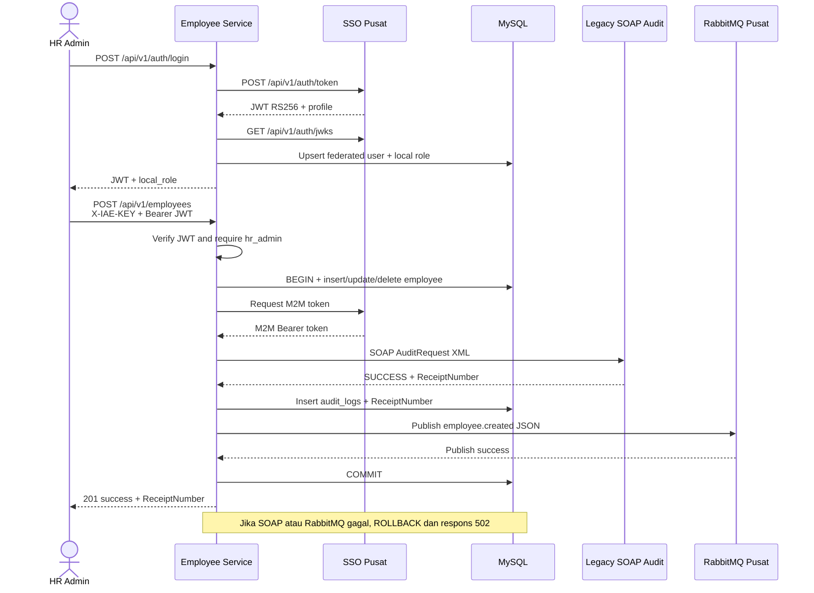

# Analisis Tugas 3 - Data Karyawan Service

## Identitas Layanan

- Domain: Penggajian Karyawan
- Layanan: Data Karyawan
- Endpoint utama: `/api/v1/employees`
- Team ID: `TEAM-09`
- Pemilik/NIM: `102022400197`

## Gambaran Proses Bisnis Service Saya

Service yang saya kerjakan adalah **Data Karyawan Service** pada sistem Penggajian Karyawan. Service ini bertanggung jawab untuk menyimpan dan mengelola data utama karyawan, seperti `employee_id`, NIK, nama, email, jabatan, departemen, gaji pokok, tunjangan tetap, dan status karyawan.

Sebelum menambahkan data karyawan, HR Admin harus melakukan login melalui endpoint `POST /api/v1/auth/login`. Employee Service akan meneruskan email dan password ke SSO pusat. JWT yang dikembalikan oleh SSO kemudian diverifikasi menggunakan public key JWKS RS256. Identitas pengguna tersebut dipetakan ke role lokal `hr_admin`.

Setelah login berhasil, HR Admin mengirim data melalui endpoint `POST /api/v1/employees` dengan header `X-IAE-KEY` dan Bearer Token. Service memvalidasi API key, JWT, role, dan data employee. Apabila seluruh validasi berhasil, data employee disimpan sementara di dalam database transaction.

Setelah itu, service meminta token M2M menggunakan API key mahasiswa. Token M2M digunakan untuk mengirim catatan transaksi ke Legacy SOAP Audit. Jika SOAP berhasil, service menerima dan menyimpan `ReceiptNumber`. Aktivitas `employee.created` kemudian dikirim ke RabbitMQ pusat agar service lain dapat mengetahui adanya karyawan baru. Database transaction hanya di-commit jika seluruh proses tersebut berhasil.

Data Karyawan Service menjadi sumber data utama bagi service lain seperti Absensi dan Payroll. Service lain harus memperoleh data karyawan melalui API dan tidak diperbolehkan mengakses database employee secara langsung.

## Alasan Endpoint POST /api/v1/employees Ditembakkan ke SOAP

Endpoint `POST /api/v1/employees` dipilih sebagai transaksi kritis karena endpoint ini membuat data karyawan baru yang akan digunakan dalam proses penggajian. Data yang disimpan mencakup informasi sensitif dan berdampak finansial, terutama NIK, gaji pokok, tunjangan tetap, jabatan, departemen, dan status kerja.

Apabila data tersebut dibuat secara tidak sah atau nilainya tidak benar, sistem Payroll dapat menghitung dan membayarkan gaji kepada orang yang tidak berhak atau menggunakan nominal yang salah. Oleh karena itu, setiap pembuatan employee harus memiliki bukti rekam jejak yang permanen.

Employee Service mengubah data JSON menjadi SOAP XML Envelope yang berisi `TeamID`, `ActivityName`, dan `LogContent`. Layanan SOAP pusat kemudian mengembalikan `ReceiptNumber`, misalnya:

```text
IAE-LOG-2026-3A42DA02
```

Nomor tersebut disimpan pada tabel `audit_logs` sebagai bukti bahwa transaksi pembuatan employee telah diterima oleh layanan audit pusat. Jika SOAP gagal atau tidak mengembalikan `ReceiptNumber`, penyimpanan employee dibatalkan dan service mengembalikan HTTP `502 Bad Gateway`.

## Alasan Endpoint POST /api/v1/employees Disiarkan ke RabbitMQ

Pembuatan employee merupakan aktivitas bisnis yang perlu diketahui oleh service lain. Setelah employee berhasil dibuat dan SOAP Audit memberikan `ReceiptNumber`, Employee Service mengirim event:

```text
employee.created
```

Event dikirim dalam format JSON dan memuat identitas service, waktu kejadian, identitas pengguna SSO, role lokal, data employee, serta `audit_receipt_number`.

RabbitMQ digunakan agar informasi karyawan baru dapat disebarkan secara asinkron dan real-time. Service lain, seperti Absensi dan Payroll, dapat menerima event tersebut tanpa melakukan request berulang kali ke Employee Service. Dengan demikian, integrasi antarservice menjadi lebih longgar dan Employee Service tidak perlu mengetahui implementasi internal setiap consumer.

Event hanya dikirim setelah SOAP Audit berhasil. Jika publish ke RabbitMQ gagal, database transaction di-rollback sehingga employee dan audit log lokal tidak tersimpan setengah jalan. Mekanisme ini menjaga agar status transaksi lokal tetap konsisten dengan hasil integrasi pusat.

## Justifikasi Transaksi Kritis

Transaksi yang dipilih adalah pembuatan, perubahan, dan penghapusan data karyawan. Ketiganya merupakan transaksi `state-changing` yang memengaruhi proses penggajian. Perubahan gaji pokok, tunjangan tetap, status kerja, atau penghapusan karyawan dapat mengubah nilai pembayaran dan kelayakan seorang karyawan menerima gaji.

Karena dampaknya bersifat finansial, hanya pengguna SSO dengan role lokal `hr_admin` yang boleh menjalankan transaksi tersebut. Setiap perubahan wajib:

1. Memvalidasi JWT pengguna dari SSO pusat menggunakan public key JWKS RS256.
2. Memetakan identitas SSO ke tabel `federated_users` dan `roles` lokal.
3. Mengubah data karyawan di dalam transaksi database.
4. Mengirim SOAP audit berisi identitas aktor dan snapshot transaksi.
5. Menyimpan `ReceiptNumber` SOAP ke tabel `audit_logs`.
6. Menyiarkan event JSON seperti `employee.created` ke RabbitMQ pusat.
7. Melakukan rollback database apabila SOAP atau publisher gagal.

Data dibroadcast karena perubahan master karyawan perlu diketahui service lain, khususnya Absensi dan Payroll, tanpa mengakses database Data Karyawan secara langsung.

## Role Lokal

| Role | Hak akses |
|---|---|
| `hr_admin` | Membuat, mengubah, dan menghapus data karyawan |
| `payroll_admin` | Dipersiapkan untuk konsumsi data penggajian |
| `viewer` | Akses baca, tidak dapat mengubah data |

JWT pusat menyediakan identitas pengguna, sedangkan otorisasi bisnis tetap dikelola aplikasi melalui tabel role lokal.

## Sequence Diagram



## Transformasi JSON ke SOAP XML

Payload transaksi JSON dibungkus ke elemen `LogContent` menggunakan CDATA. Envelope menggunakan tag wajib `TeamID`, `ActivityName`, dan `LogContent`.

```xml
<soap:Envelope xmlns:soap="http://schemas.xmlsoap.org/soap/envelope/"
               xmlns:iae="http://iae.central/audit">
  <soap:Body>
    <iae:AuditRequest>
      <iae:TeamID>TEAM-09</iae:TeamID>
      <iae:ActivityName>EmployeeCreated</iae:ActivityName>
      <iae:LogContent><![CDATA[{"event":"employee.created"}]]></iae:LogContent>
    </iae:AuditRequest>
  </soap:Body>
</soap:Envelope>
```

## Event RabbitMQ

Publisher mengirim JSON melalui endpoint pusat `/api/v1/messages/publish`.

```json
{
  "routing_key": "employee.created",
  "message": {
    "service": "Data-Karyawan-Service",
    "event": "employee.created",
    "actor": {
      "subject": "warga01@ktp.iae.id",
      "local_role": "hr_admin"
    },
    "employee": {
      "employee_id": "EMP-001"
    },
    "audit_receipt_number": "IAE-LOG-2026-8891A7BC"
  }
}
```

## Penanganan Kegagalan

- JWT tidak ada/tidak valid: `401`.
- Role bukan `hr_admin`: `403`.
- Payload employee tidak valid: `422`.
- SOAP atau publisher pusat gagal: `502`, employee dan audit log lokal di-rollback.
- Data employee tidak ditemukan: `404`.

## Cara Verifikasi

1. Isi `IAE_M2M_API_KEY` pada `.env` menggunakan key mahasiswa yang diberikan dosen.
2. Jalankan `docker compose up --build`.
3. Import `postman/Tugas-3-Employee-Service.postman_collection.json`.
4. Jalankan request berurutan mulai dari `Login SSO`.
5. Pastikan respons create/update/delete berisi `audit_receipt_number`.
6. Jalankan `php artisan test` untuk pengujian otomatis dengan layanan pusat dimock.
